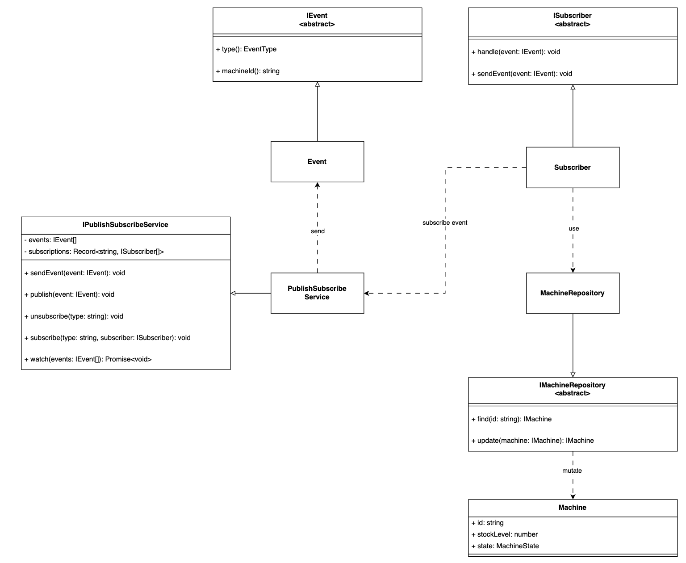

Assignment PubSub mechanism

owner: nutchapon hanouypornlert

email: nutchapon.han@gmail.com

### Summary Assignment

#### Requirement

1. on **IPublishSubscribeService**

   - implement **subscribe** to registering subscribers
   - implement **publish** method to publish event to all subscribers (subscribers should be working off a shared array of Machine objects)
   - implement **unsubscribe** allow handlers to unsubscribe from events

2. implement **MachineRefillSubscriber**

   - increase the stock quantity of the machine

3. implement new behavior

   - if a machine stock levels drops below 3 a new Event, LowStockWarningEvent should be generated
   - if a stock levels hits 3 or above, StockLevelOkEvent should be generated
   - LowStockWarningEvent or StockLevelOkEvent should only fire one time when crossing the threshold of 3 for each machine

extra credit

- implement using with repository pattern
- new event should handle in correct order

### Diagram for pub-sub program



### Project Description

#### structure

```
src
├── index.ts  // main program
├── machine   // all machine component program
├── type      // type and interface
└── utils     // useful script
```

#### how to run program

My publish-subscribe mechanism used code base from initial app.ts for first step and then implementing software with repository pattern for mutate _Machine_ and _Subscriber_ to allow our code are independency so we can easier changing each dependency if it fit to interface requirement.

our program setup with 3 machine shared state (001, 002, 003) and our pubsub used for mutate each machine depend on specific event occur.

for easier checking result i've adding some log into my codebase so it will show publish event and state machine after each event occur.

**system requirement**

- node version 20 or above
- `yarn` or `npm` is okay

**Install dependency**

- run `yarn`

**Testing program**

1. run program with normal case random generate 5 events

- run `yarn start`

2. run program with simple simulation (simulate sale event on specific machine id "001" to testing "LowStockWarningEvent" was fired and refill until "StockLevelOkEvent" was send)

- run `yarn start simple`

3. run program with simple simulation (simulate sale event on machine id "001" and "002" to testing "LowStockWarningEvent" was fired and refill until "StockLevelOkEvent" was send in correct order)

- run `yarn start complex`
